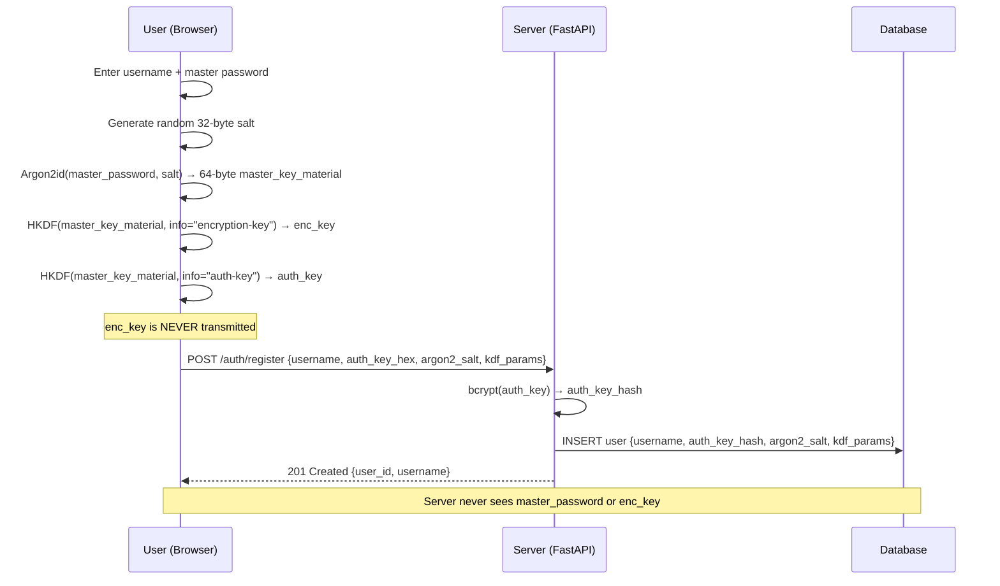
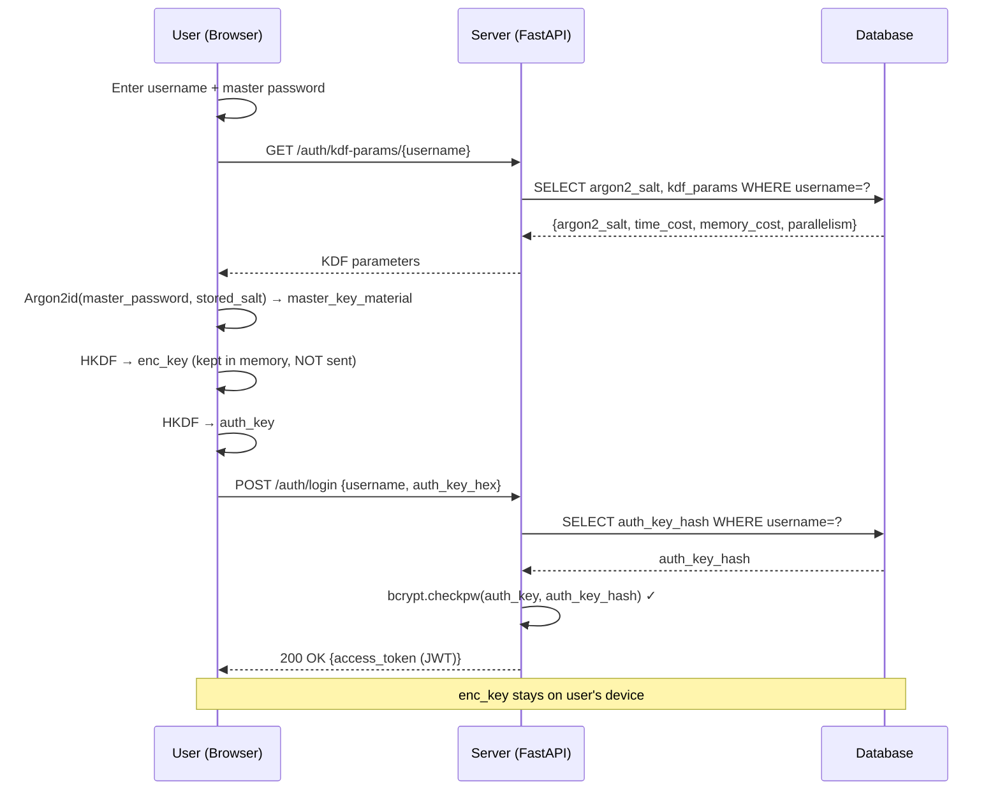
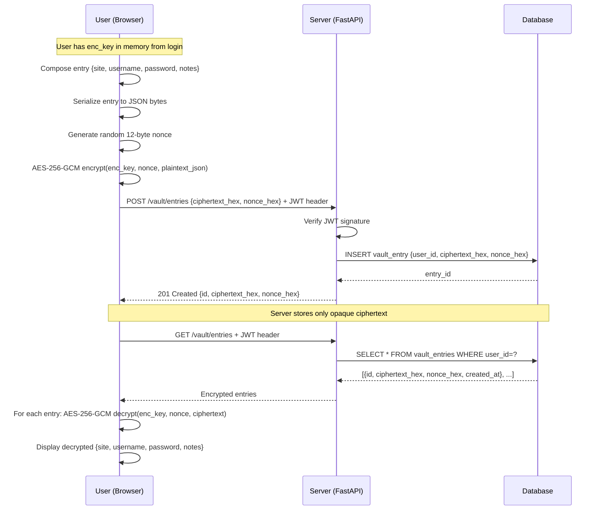

# 🔐 ZeroVault

> A zero-knowledge password manager — the server never sees your passwords, vault entries, or encryption key.

[](https://github.com/yourusername/zerovault/actions/workflows/ci.yml)
[](https://python.org)
[](LICENSE)

---

## What is Zero-Knowledge?

Imagine you keep your passwords in a locked box.  You hand the locked box to someone to keep safe.  They can store it, give it back to you on request, and even check that it's the right box — but they cannot open it because they never had the key.

ZeroVault works the same way:

- Your master password stays **on your device** — it is never sent to the server.
- A cryptographic key is derived from your master password on your device.
- Your vault entries (site names, usernames, passwords, notes) are **encrypted on your device** before being uploaded.
- The server stores only encrypted blobs.  Even if an attacker broke into the server and copied everything, they would see only random-looking bytes — worthless without your master password.

**"Zero-knowledge"** means the server has zero knowledge of your actual vault contents.

---

## Architecture

### The Two-Key Pattern

ZeroVault derives two independent keys from your master password:

```
Your Master Password
        │
    Argon2id           ← Memory-hard algorithm; takes ~65ms per attempt
    (+ random salt)       making brute-force extremely expensive
        │
  64 bytes of key material
        │
       HKDF            ← Cryptographic key expansion with domain labels
       ├── Encryption Key (32 bytes)  →  encrypts your vault entries
       │                                  NEVER sent to server
       └── Auth Key    (32 bytes)     →  proves your identity to the server
                                         server stores only bcrypt(auth_key)
```

This means: even if someone cracks the server's password database, they get the `auth_key` hash — which lets them log in (as you), but gives them **zero** ability to decrypt your vault.  The encryption key is a completely separate secret.

---

## Registration Flow



---

## Login Flow



---

## Vault Entry Flow



---

## Stack

| Layer | Technology | Version |
|-------|-----------|---------|
| Frontend | [Reflex](https://reflex.dev) (pure Python) | 0.8.x |
| Backend | [FastAPI](https://fastapi.tiangolo.com) | 0.135.x |
| Database | PostgreSQL + SQLAlchemy async ORM | PG 16, SA 2.0 |
| Password KDF | Argon2id via `argon2-cffi` | 25.1.0 |
| Vault encryption | AES-256-GCM via `cryptography` | 46.0.x |
| Key expansion | HKDF-SHA256 via `cryptography` | 46.0.x |
| Auth storage | bcrypt via `bcrypt` | 4.2.x |
| Auth tokens | JWT via `PyJWT` | 2.12.x |
| Testing | pytest + pytest-asyncio | 8.x / 0.25.x |
| Containers | Docker Compose | — |

---

## Project Structure

```
zerovault/
├── backend/
│   ├── app/
│   │   ├── crypto/
│   │   │   ├── __init__.py        # Package exports
│   │   │   ├── constants.py       # Argon2 params with justification comments
│   │   │   ├── kdf.py             # Argon2id + HKDF two-key derivation
│   │   │   ├── vault_cipher.py    # AES-256-GCM encrypt/decrypt
│   │   │   └── auth_key.py        # bcrypt hash/verify for auth_key
│   │   ├── routers/
│   │   │   ├── auth.py            # Registration, KDF params, login endpoints
│   │   │   └── vault.py           # Vault CRUD endpoints
│   │   ├── main.py                # FastAPI app factory
│   │   ├── models.py              # SQLAlchemy ORM models
│   │   ├── schemas.py             # Pydantic v2 request/response models
│   │   ├── auth.py                # JWT creation and verification
│   │   ├── database.py            # Async engine + session factory
│   │   └── config.py              # pydantic-settings environment config
│   ├── requirements.txt
│   └── Dockerfile
├── frontend/
│   ├── zerovault/
│   │   ├── state.py               # Reflex State: crypto, API calls, vault
│   │   ├── components.py          # Reflex UI: login, register, vault pages
│   │   └── zerovault.py           # App entry point + routing
│   ├── rxconfig.py
│   ├── requirements.txt
│   └── Dockerfile
├── tests/
│   ├── conftest.py                # Fixtures: in-memory SQLite, async client
│   ├── test_kdf.py                # Key derivation tests
│   ├── test_vault_cipher.py       # Encryption/decryption tests
│   ├── test_auth_key.py           # bcrypt hash/verify tests
│   └── test_auth_flow.py          # End-to-end HTTP integration tests
├── .github/
│   └── workflows/
│       └── ci.yml                 # GitHub Actions: pytest on push
├── docker-compose.yml
├── pytest.ini
├── CRYPTOGRAPHY.md               # Detailed crypto design document
├── SECURITY.md                   # Threat model + what server stores
└── README.md                     # This file
```

---

## Quick Start (Local Development)

### Prerequisites

- Python 3.12+
- Docker and Docker Compose
- Node.js 20+ (required by Reflex for frontend compilation)

### 1. Clone and configure

```bash
git clone https://github.com/yourusername/zerovault.git
cd zerovault
cp .env.example .env
# Edit .env and set a real JWT_SECRET_KEY:
python -c "import secrets; print(secrets.token_hex(32))"
```

### 2. Start with Docker Compose

```bash
docker compose up --build
```

Default host ports are intentionally non-standard to reduce collisions when
running multiple projects in parallel. You can override them with environment
variables before starting Compose:

```bash
ZV_DB_PORT=55439
ZV_BACKEND_PORT=38170
ZV_FRONTEND_PORT=37420
ZV_REFLEX_BACKEND_PORT=38171
docker compose up --build
```

Services will start on:
- Frontend (Reflex): http://localhost:37420
- Backend (FastAPI): http://localhost:38170
- API docs: http://localhost:38170/docs
- Database: localhost:55439

### 3. Local development (without Docker)

**Backend:**

```bash
cd backend
python -m venv .venv
source .venv/bin/activate       # Windows: .venv\Scripts\activate
pip install -r requirements.txt
pip install aiosqlite            # For tests

# Start PostgreSQL separately (or use Docker just for DB):
docker compose up db -d

# Run FastAPI
uvicorn zerovault.app.main:app --reload --port 38170
```

**Frontend:**

```bash
cd frontend
python -m venv .venv
source .venv/bin/activate
pip install -r requirements.txt
reflex init
reflex run
```

Reflex development defaults are configured in `frontend/rxconfig.py` and can
also be overridden with:

- `ZV_FRONTEND_PORT` (default `37420`)
- `ZV_REFLEX_BACKEND_PORT` (default `38171`)

---

## Running Tests

Tests use an in-memory SQLite database — no running PostgreSQL required.

```bash
cd backend
pip install aiosqlite            # SQLite async driver for tests

# Run all tests
pytest -v

# Run a specific module
pytest tests/test_kdf.py -v
pytest tests/test_vault_cipher.py -v
pytest tests/test_auth_flow.py -v

# Run with coverage
pip install pytest-cov
pytest --cov=zerovault --cov-report=term-missing
```

**All cryptographic operations are real** — no mocking.  Argon2 parameters
are reduced to their minimums in test fixtures so each test completes in
milliseconds rather than seconds.

---

## Security Highlights

- **Master password never transmitted** — derived keys only
- **Two-key derivation** — enc_key and auth_key are independent; cracking one reveals nothing about the other
- **Argon2id** — memory-hard KDF; GPU/ASIC attacks are memory-bandwidth limited
- **AES-256-GCM** — authenticated encryption; server cannot forge or silently tamper with ciphertext
- **Random nonces** — `os.urandom(12)` per entry; nonce reuse is not possible
- **bcrypt on auth_key** — defence-in-depth; even a memory leak of auth_key requires cracking bcrypt
- **PyJWT** — used instead of `python-jose` which has known CVEs
- **`os.urandom` throughout** — `random` module never used for security material

See [CRYPTOGRAPHY.md](CRYPTOGRAPHY.md) for the full cryptographic design rationale and [SECURITY.md](SECURITY.md) for the complete threat model.

---

## Cryptographic Design Decisions at a Glance

| Decision | Alternative | Why ZeroVault's approach is better |
|----------|-------------|-----------------------------------|
| Argon2id KDF | PBKDF2, bcrypt alone | Memory-hard; GPU/ASIC attacks 100–1000× slower |
| Two HKDF-derived keys | Single key for both | Cracking auth_key reveals nothing about enc_key |
| AES-256-GCM | AES-CBC + HMAC | AEAD; single primitive; no padding oracle risk |
| Random nonces | Counter/sequential nonces | No state required; no nonce-reuse risk |
| PyJWT | python-jose | python-jose has CVE-2024-33663/33664 |
| bcrypt on auth_key | Plaintext auth_key | Defence in depth; standard credential storage practice |
| `os.urandom` | `random.randbytes` | `random` is a PRNG; `os.urandom` is CSPRNG |

---

## License

MIT — see [LICENSE](LICENSE).
